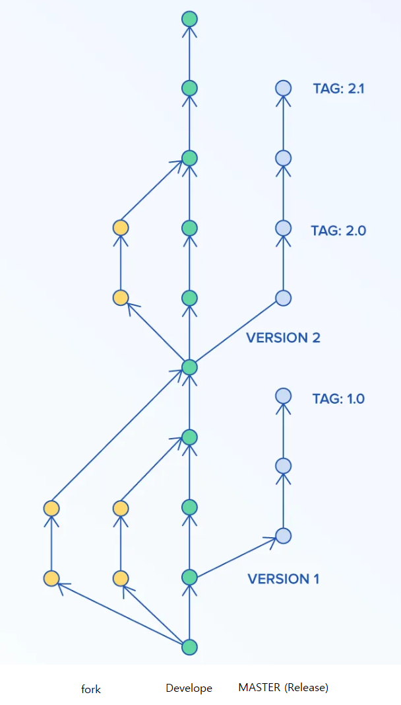

### Git Workflow

 
#### 1. 개요

- 개인적인 이슈처리는 develope 브랜치에서 각각 fork 하여 수행하고 Pull-Request로 merge한다.
- develope 브랜치에서 배포가능하게 되면 Master 브랜치로 merge하며 태그하는 버전은 semantic versioning 2.0.0 을 따른다. 
- semantic versioning은 MAJOR.MINOR.PATCH 형태이며, patch는 배포 가능 버전순으로 증가한다.
출처 : https://semver.org/

 
#### 2. fork 하기

   - WEB IDE 에서
    
    - (1) branch가 develope인지 확인하고, (2) fork를 누른다.
    
    - (3) project name의 뒤에 자신의 이름을 더 붙이고, (4) select a namespace에 자신의 계정을 설정한다.
    - fork해온 repo에서 이슈처리후 commit, push한다. 티켓 완료시 최소 한번 이상 commit 한다.
    
    - (5) 티켓 완료시 merge를 요청한다.
    )
    - (6) Title은 commit title을 그대로 사용한다(default). 더 추가적으로 설명할 내용은 (7) description에 쓰고 자신을 assignee에 필수로 리뷰해주면 하는 사람에게 Reviewer를 달자.
    
    - merge requests에서 (8)changes 창에서 (9) 코드에 드래그, 클릭하면 해당 코드부분에 리뷰를 작성할 수 있다. Add to review는 리뷰를 add to comment는 다른 리뷰어가 남긴 리뷰에 댓글로 사용한다. comment에 경우 바로 보이지만 review는 add해도 pending 상태로 나온다.
    
    - 리뷰가 끝나면 finish review를 누르면 내가 작성한 리뷰를 다른 사람도 볼 수 있다. approve merge request 체크박스를 체크하고 finish 하면 해당 코드의 merge를 승인한다는 의미이고, 2인 이상이 승인하면 develope 브랜치에 merge된다.
    - 